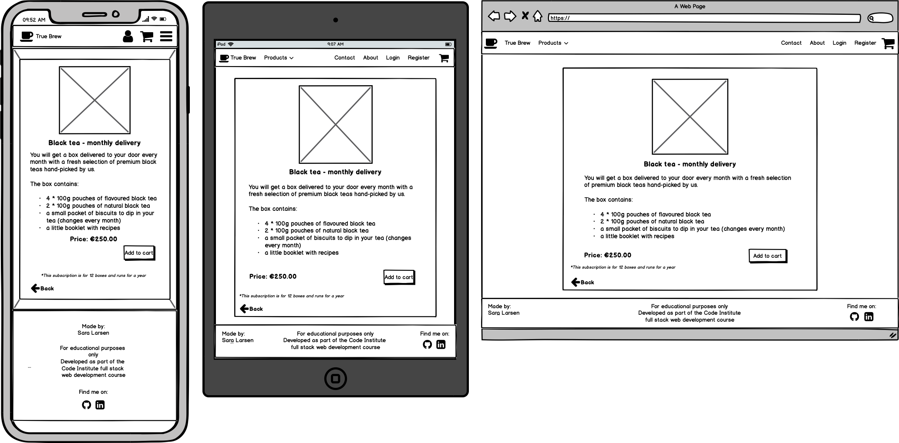
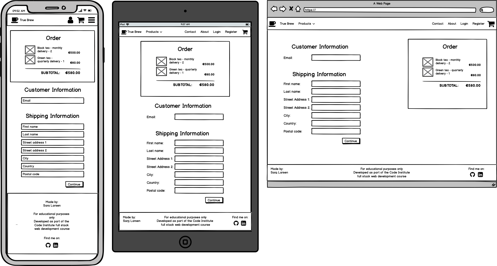
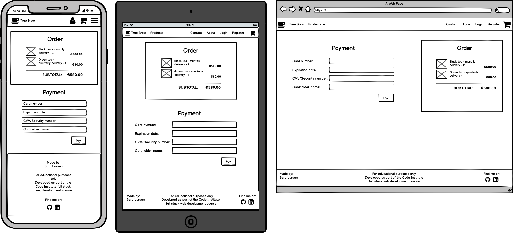
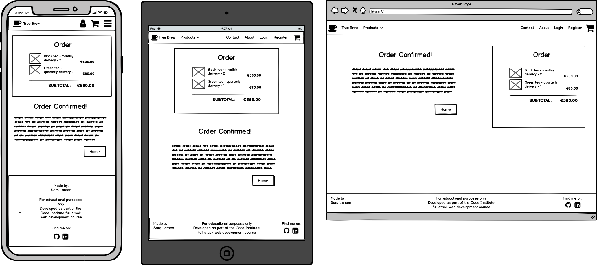
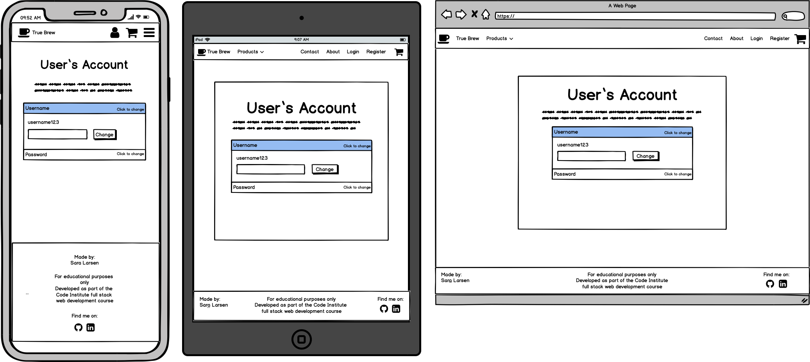

## Table of Contents
1. [True Brew](#true-brew)
2. [UX](#ux)
    1. [Design and Layout](#design-and-layout)
    2. [User Stories](#user-stories)
    3. [Wireframes](#wireframes)
        1. [Wireframe Differences](#wireframe-differences)
3. [Features](#features)
    1. [Existing Features](#existing-features)
    2. [Features Left to Implement](#features-left-to-implement) 
4. [Technologies and Tools Used](#technologies-and-tools-used)
5. [Testing](#testing)
6. [Deployment](#deployment)
    1. [Cloning and running the project locally](#cloning-and-running-the-project-locally)
7. [Credits](#credits)
    1. [Code](#code)
    2. [Content and Media](#content-and-media)
    3. [Acknowledgments](#acknowledgments)

# True Brew
True Brew is my final milestone project for the Code Institute Full-Stack Web Development course making use of the programming languages and frameworks taught in all the modules throughout the course.
It is an e-commerce site where users can register for an account and buy loose-leaf tea subscription boxes.\
The live site can be found at [True Brew](https://truebrew.herokuapp.com/)
## UX
The target audience for this website are people who are passionate tea-drinkers and who are interested in buying and drinking tea of a better quality and with more varieties than what can usually be found in supermarkets.\
The website also caters to people with a sense of adventure and who like the element of suprise given that they do not have full control over which products they are going to receive in the boxes.\
A user's goals/needs would include:
- finding a subscription box with a type of tea they like
- finding a gift for a tea-drinker in their life
- browsing all products and reading descriptions of each kind of tea
- keeping track of account and order details

With these user goals in mind, I came up with several user stories and then created wireframes for a blueprint of how best to meet the needs of the users (these can be found under the Design and Layout section).

### Design and Layout
As the business in this project sells products that would typically be enjoyed during a break or a relaxing night in, I wanted a clean and calm-looking design, rather than something busy with vibrant colours and lots going on.\
I therefore picked two calming colours to be used throughout the website. For the brand logo and name, footer and action buttons (log in, register, pay etc) I used a delicate green (#a3c77b), and for text, borders, shadows and product buttons I used a dark brown (#573723).\
I also tried to pick specific shades of green and brown that would be associated with green and black tea in the mind.\
As the background image for the landing page and log in and registration views, I picked a simple photo of a teapot with light colours. To ensure the green colour mentioned above did not clash with the photo, I used the colour picker tool on a leaf in the photo and extracted it from there.

The font used for the brand name is [Merienda](https://fonts.google.com/specimen/Merienda). The name is a Spanish term for 'afternoon snack' and with its soft strokes, it was the perfect fit for a business selling a relaxing product like tea.\
The classic [Open Sans](https://fonts.google.com/specimen/Open+Sans) was used for all other text due to its excellent legibility and readability.

### User Stories
1. as a first-time user of the website, I want to be able to intuitively browse so that I do not have to hunt around for things
2. as a first-time user, I want to be able to find out what services are offered and who is behind them
3. as a first-time user, I want to be able to see what is on offer before registering for an account
4. as a new user who is ready to register, I want to be able to do so quickly and easily
5. as a returning user, I want to be able to log in to my account
6. as a returning user who forgot my password, I want to be able to reset it so that I can log in again
7. as a returning user, I want to be able to add an address so I can checkout faster
8. as a returning customer, I want to be able to see an overview of my previous orders
9. as a user who has decided to buy a product, I want to be able to add it to a cart and have easy access to checking the cart
10. as a user who has decided to buy a product, I want a quick and easy checkout process
11. as a user, registered or not, I want a convenient way to get in touch with the business
12. as a logged in user who is ready to leave the website, I want to be able to log out so that I do not leave personal information accessible to others

### Wireframes
I created wireframes for small, medium and large screens for the following pages on the website:
- [Home](wireframes/about.png)
- [About](wireframes/about.png)
- [User Account](wireframes/account.png)
- [Login](wireframes/login.png)
- [Register](wireframes/register.png)
- [Product view](wireframes/product.png)
- [Cart](wireframes/cart.png)
- [Checkout](wireframes/checkout.png)
- [Payment](wireframes/payment.png)
- [Order Confirmation](wireframes/order-confirmation.png)
- [Contact](wireframes/contact.png)

#### Wireframe Differences
- **Product view:** as shown in the wireframe below, I initially planned on having a product card for all subscriptions for all teas in the all_products view (18 cards in total), but it quickly became clear that it would look very cluttered and chaotic, and instead I settled on the current design where there is only one card per tea, and the subscriptions are only shown once the user clicks on a specific tea.

- **Checkout in one step:** the checkout process was supposed to be in two steps as shown below. First, the user would fill out their address details, then click next and get to a payment view. However, when I implemented Stripe Elements and saw that the credit card form took up very little space, it seemed over the top to place it on a separate page.\
An added benefit here is that the checkout process takes less clicks which increases the chance of the user going through with the purchase.

- **Order confirmation page:** in the end, it turned out there was not enough content to justify a separate view for the order confirmation at this stage, and I instead return the customer to their account page with a success message.\

- **User account page:** when I created the wireframes, I had a fairly simple account page in mind. It was just going to show the username and maybe email address, and they would be able to change them to something else. But when I started building it, it seemed too simple and not very useful to the users. Instead it would be ideal to have the option to fill out an address for later checkouts and to show the user their previous orders, so I set out to include that as well.

- **About page:** the decision to take out the separate About page was taken because it would not have added anything new to the website. For now, the **About Us** section on the home page contains all the info that would have been on an About page. As a potential future feature I have listed a **Blog section** (see below), which would be a sort of enhanced About page with introductions to staff etc.

## Features
### Existing Features
- **Navbar:** the website has a navbar that stays at the top in all views for easy access to all pages. There is always a 'Home' link, a dropdown menu with access to the products, a 'Contact' page link and a link to the cart. If the user is not logged in, the navbar will show 'Login' and 'Register' links, while a logged in user will see 'Account' and 'Logout' links.\
On small screens, the navbar is collapsed into a dropdown menu and there are quick access links to the cart and the account page.
- **Home page:** the first section of the home page consists of a background image and a short descriptive text over the image. This section takes up a third of the viewport height which allows the user to get a glimpse of the second section from the start and signals to the user to scroll down.\
Next is a Products section showing cards for the teas that are sold by the business. A user can click on the button in each card to get to the product page for that specific product.\
Last is the About Us section which has two info boxes. The first one gives details about the box subscription services provided by the business, and the second one has some background info on the business and the people behind it.
- **Products page:** from the dropdown menu in the navbar, the user can get to a page similar to the middle section on the home page. This page also has cards for all teas sold by the business.
- **Product view:** when a user clicks on the 'Subscribe' button in one of the product cards, they are taken to a page showing details about the chosen tea. Underneath, the user will see three cards with information on the three types of subscription available (monthly, quarterly or semiannual delivery).\
On small screens, each of the cards will take up the full viewport width and are stacked while they will be shown on a single row on medium sizes and up.
- **Contact page:** this page has a very straight-forward form for sending the business a message. There are 4 inputs: user (if the user is logged in, this will be prepopulated. It is hidden because users are not meant to interact with this field), email address (this is also prepopulated for logged in users), title and message_body.\
When a user clicks the Send button, the message is saved in the database for later retrieval and an email is sent to the business mailbox.
- **Cart:** when a user adds something to the cart, they are rerouted to the cart view which can also be reached at any time from the navbar. The cart shows an overview of the products currently in the users cart, and from here they can adjust the number of items or delete something completely from the cart. There are two buttons in the cart view: one for going back to viewing all products and one for continuing to checkout.
- **Checkout:** the checkout view shows an order summary on the left-hand side on medium screens and up (at the top on small screens) and on the right-hand side is the checkout form (bottom on small screens). The form input fields prepopulate with any available data from the User and UserInfo models. At the bottom of the form is the Stripe form which handles payments.
- **User registration, login and logout:** as it is not possible to checkout without having an account and being logged in, users will have to register before they can buy anything.\
They do this by going to the Registration page available from the navbar. Here they fill in the standard Django form for user registrations picking a username and password and providing an email address. If the form contains errors, error messages will appear to let the user know what they need to change. Once the account has been created, the user will be logged in and redirected to the home page with a success message.\
The user is now able to log in and out at any time using the links in the navbar.
- **Password reset:** the website uses the Django reset password functionality so that users can receive an email with a reset link in case they have forgotten their password.
- **User account page:** users have access to an account page where they can see, add and edit address and contact details. They can also see their order and message history.
- **Messages:** the website provides feedback to user in the form of the Django messages framework. Any time a user does something active like registering, logging in and out, sending a message and paying, they will receive feedback on it via success or error messages.

### Features Left to Implement
- **Stripe Checkout or Payment Intents:** For now, this project uses the Stripe Charges API as it was taught in the course (with some changes due to the project using Stripe V3 and not V2 as in the course), but this is not ideal as it does not handle payments that need card authentication which is widely used in Europe. I would have liked to implement either Stripe Checkout or the Payment Intents API, but I was not able to do so with the time available to me. I am hoping to be able to implement this once I have more time and experience.
- **Recurring payments:** As it is now, a user will be charged the full amount up front for all the boxes they are going to receive, but this is not ideal as most people are likely to prefer paying a smaller amount with regular intervals.
- **Delivery addresses:** I would like to implement at some point the option to enter a separate delivery address for each subscription in the order so that users can buy a subscription as a gift for someone else and have it shipped directly to the recipient.
- **Search functionality:** At the moment, a search functionality is not necessary as there is a limited number of products available (6 types of tea with 3 kinds of subscriptions), but if the business were to expand their range of products (selling loose leaf tea by quantity, accessories etc), a search function would definitely become needed in order for users to easily locate what they are looking for.
- **User reviews:** Reviews from other customers are a powerful way to showcase products and services and to show that the business is trustworthy, so adding a section with reviews on the home page is another good potential feature.
- **Blog section:** This is a good way for a business to really showcase their products, especially a business that constantly renews their inventory. A blog section would allow the buisness to write more in detail about the different teas in each month's boxes and to give tips, share recipes and so on.\
In addition, it would allow the business to cultivate a more personal relationship with their customers and introduce their employees to them.

### Databases/Models
While developing the app, the SQL database used was the **sqlite3** database that comes with Django.\
In production I used the **PostgreSQL** database available on Heroku.

#### Accounts app models
I used the **User** model provided by Django for letting users register and log in. In addition, I created a custom **UserInfo** model:
| Key             | Field Type | Validation                |
|-----------------|------------|---------------------------|
| user            | OneToOne   | on_delete=models.CASCADE  |
| street_address1 | CharField  | max_length=40, blank=True |
| street_address2 | CharField  | max_length=40, blank=True |
| town_or_city    | CharField  | max_length=40, blank=True |
| postcode        | CharField  | max_length=20, blank=True |
| county          | CharField  | max_length=40, blank=True |
| country         | CharField  | max_length=40, blank=True |
| phone_number    | CharField  | max_length=20, blank=True |

An object in this model has a one-to-one relationship with a User object, and the user can store address and contact info here for faster checkouts. Apart from the user field, all the fields are allowed to be blank because users are not required to enter their details in the database if they do not want to.

#### Checkout app models
the **Order** model:
| Key             | Field Type | Validation                 |
|-----------------|------------|----------------------------|
| user            | OneToOne   | on_delete=models.CASCADE   |
| full_name       | CharField  | max_length=50              |
| street_address1 | CharField  | max_length=40              |
| street_address2 | CharField  | max_length=40, blank=True  |
| town_or_city    | CharField  | max_length=40              |
| postcode        | CharField  | max_length=20, blank=True  |
| county          | CharField  | max_length=40, blank=True  |
| country         | CharField  | max_length=40              |
| email           | EmailField |                            |
| phone_number    | CharField  | max_length=20              |
| date            | DateField  | auto_now_add=True          |

This model is used for storing orders. Each order object is related to a user on a one-to-one basis, so they can be retrieved and displayed on the user's account page. **street_address2**, **postcode** and **county** are allowed to be blank as they are not necessarily used in all countries in the world.

The **OrderLineItem** model:
| Key          | Field Type   | Validation               |
|--------------|--------------|--------------------------|
| order        | ForeignKey   | on_delete=models.CASCADE |
| subscription | ForeignKey   | on_delete=models.SET_DEFAULT, default='No longer available' |
| quantity     | IntegerField |                          |

This model stores an object for each item in an order. Each object relates to an Order and represents a particular subscription object in the Subscription model (Products app).

#### Pages app models
The **ContactMessage** model:
| Key             | Field Type | Validation                 |
|-----------------|------------|----------------------------|
| user            | ForeignKey | on_delete=models.CASCADE, blank=True, null=True|
| email           | EmailField    |                         |
| title           | CharField     | max_length=150          |
| message_body    | TextField     |                         |
| date_sent       | DateTimeField | auto_now_add=True       |

This model stores all messages sent through the Contact page form. If it was sent by a logged in user, the message has a ForeignKey to that user, allowing it to be retrieved and displayed on the user's account page. The user input field is not shown on the contact form.

#### Products app models
The **Product** model:
| Key               | Field Type | Validation                 |
|-------------------|------------|----------------------------|
| title             | CharField  | max_length=50              |
| category          | CharField  | max_length=20, choices=TEA_CHOICES,default=BLACK_TEA   |
| image             | ImageField |                            |
| description       | TextField  |                            |
| short_description | TextField  |                            |

This model stores an object for each tea available in the store.

The **Subscription** model:
| Key               | Field Type   | Validation                         |
|-------------------|--------------|------------------------------------|
| frequency         | CharField    | max_length=15                      |
| description       | TextField    |                                    |
| unit_price        | DecimalField | max_digits=6, decimal_places=2     |
| practical_info    | CharField    | max_length=200                     |
| product           | ForeignKey   | on_delete=models.CASCADE, null=True|

Each object in this database is a specific subscription related to a specific object in the Product database.

## Technologies and Tools Used
- HTML, CSS, JavaScript and Python were used to build the webpage
- The [Django framework](https://palletsprojects.com/p/flask/)
- The [Bootstrap](https://getbootstrap.com/) framework was used to set up a responsive layout
- [Gitpod](https://www.gitpod.io/) was used as the IDE for this Project
- [Git](https://git-scm.com/) and [GitHub](https://github.com/) were used for version control and repository hosting
- [Heroku](https://www.heroku.com/) was used as the platform for deployment of the website
- [Autoprefixer](https://autoprefixer.github.io/) was used to add vendor prefixes to CSS code
- [Google Fonts](https://fonts.google.com/) provided the fonts used throughout the website
- [Canva](https://www.canva.com/) was used to design the website logo and [Favicon.io](https://favicon.io/) to turn it into a favicon
- [Font Awesome](https://fontawesome.com/) provided all icons used throughout the website
- [Balsamiq](https://balsamiq.com/) was used to create wireframes for the project
- [Amazon S3 Bucket](https://aws.amazon.com/s3/) was used to store images
- [Django Storages](https://django-storages.readthedocs.io/en/latest/) and [Boto3](https://boto3.amazonaws.com/v1/documentation/api/latest/index.html) were used to connect Django with S3
- [Stripe](https://stripe.com/) was used for card payments

## Testing
See the separate [TESTING.md](TESTING.md)

## Deployment
This project was developed in Gitpod and pushed regularly to the GitHub repository via git commands in the terminal.\
The website was deployed on Heroku via the following steps:
1. I created an app on Heroku and connected to it on Gitpod in the terminal
2. I set the necessary config vars in the Heroku Settings tab (secret key, MongoDB name, MongoDB URI, IP and PORT)
3. I regularly pushed code from Gitpod to Heroku via the command line (later I set up automatic deploys from the master branch
in the Heroku Deploy tab)
4. The app was then available on ...

### Cloning and running the project locally
Follow these steps if you wish to run the project locally:
- go to the [repository page](https://github.com/Sarani1612/truebrew) on GitHub
- click the "clone or download" button on the right-hand side
- copy the URL that shows up
- in Terminal, change the current working directory to the location where you want the cloned directory to be made
- type 'git clone' and paste the URL from step 2
- press enter
- the local clone will be created

These instructions and more info can be found at [this GitHub Help Page](https://help.github.com/en/github/creating-cloning-and-archiving-repositories/cloning-a-repository).

## Credits

### Code:
- [This guide by Vitor Freitas](https://simpleisbetterthancomplex.com/tutorial/2016/07/22/how-to-extend-django-user-model.html#onetoone) was used to help me extend the User model
- [John Elder's Codemy](https://codemy.com/) course on Django user authentication helped me set up the login/registration forms and views.
- [This guide by Dan Kaufhold](https://blog.bitlabstudio.com/ultra-short-guide-to-django-and-amazon-s3-2c5aae805ce4) helped me set up S3 media hosting

### Content and Media
- The texts about the different kinds of tea were adapted from [Republic of Tea](https://www.republicoftea.com/)
- The images for the background and the mixed tea section are free images from [Pixabay](https://pixabay.com/):
  - Background photo from  [dungthuyvunguyen](https://pixabay.com/users/dungthuyvunguyen-5499796/)
  - Mixed teas photo from [gate74](https://pixabay.com/users/gate74-5942741/?utm_source=link-attribution&utm_medium=referral&utm_campaign=image&utm_content=2519551)
- The other photos of the different tea types are from [Nordic Tea](https://nordic-tea.dk/) (For educational use only. No copyright infringement intended.)

### Acknowledgments
- Thank you to Xavier at the Code Institute for pointing me in the right direction with how to relate the Product and Subscription models.
- Thank you to my partner and to my sister for testing the app

*This website is for educational purposes only. It was created as part of the Code Institute Full Stack Developer course.*